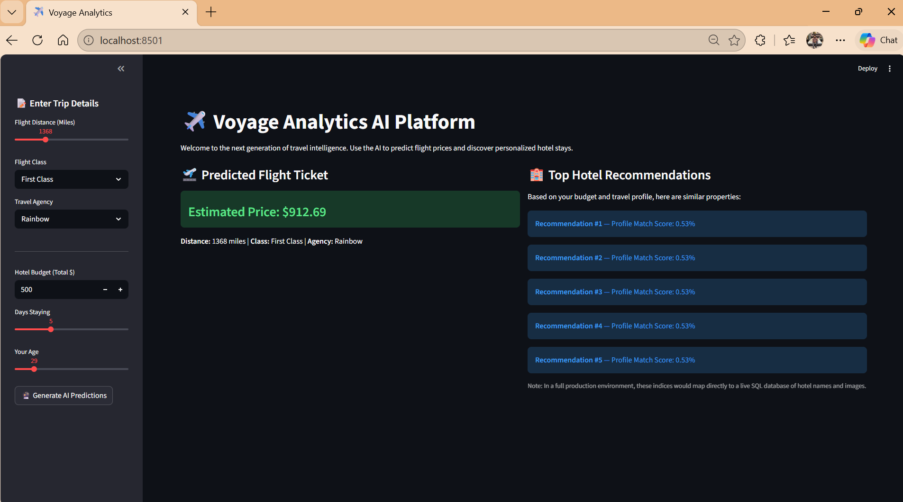

# Voyage Analytics: MLOps in Travel

## Project Overview
This project is an end-to-end Machine Learning pipeline designed for the travel and tourism industry. It transitions raw, relational data into a production-ready AI system capable of dynamic pricing and personalized user recommendations.

**Key Features:**
* **Predictive Pricing Engine:** A tuned Random Forest Regressor ($R^2$ > 0.99) that predicts flight prices based on travel distance, class, and agency.
* **Targeted Marketing Analytics:** A Random Forest Classifier that predicts user demographics (gender) based on booking behavior and spending habits.
* **Intelligent Accommodation System:** A K-Nearest Neighbors (KNN) recommendation engine utilizing Euclidean distance to match users with highly relevant hotel stays.
* **Production Deployment:** Containerized via Docker and served through a Flask REST API and an interactive Streamlit frontend.

## Web Application Preview
Here is a look at the working Streamlit UI predicting flight prices and recommending hotels:

## How to Run Locally (Without Docker)
1. Install dependencies: `pip install -r requirements.txt`
2. Start the Backend API: `python app.py`
3. In a new terminal, start the Frontend: `streamlit run streamlit_app.py`

## How to Run with Docker
1. Build the image: `docker build -t voyage_mlops_app .`
2. Run the container: `docker run -p 8501:8501 voyage_mlops_app`
3. Open a browser and navigate to `http://localhost:8501`
